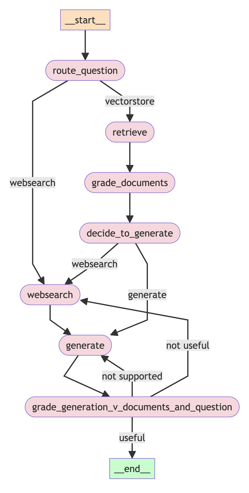
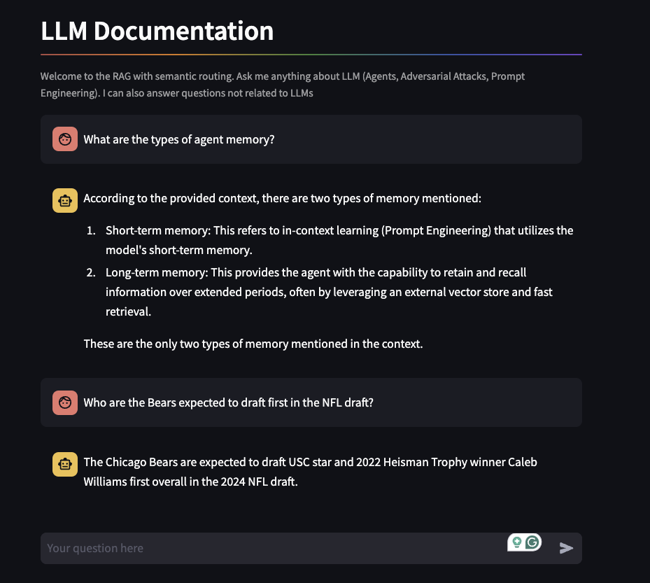

# RAG with Semantic Routing <!-- omit in toc -->

This repository contains the code for building and running a RAG system that includes Semantic Routing.

[](https://github.com/UribeAlejandro/RAG_SemanticRouting/actions/workflows/ci.yml)

## Table of Contents <!-- omit in toc -->
- [Overview](#overview)
- [Setup the environment](#setup-the-environment)
  - [Installation](#installation)
  - [Models](#models)
  - [Langsmith](#langsmith)
  - [Web Search](#web-search)
- [Running the code](#running-the-code)
  - [Extract, Transform \& Load](#extract-transform--load)
  - [Query](#query)
- [References](#references)


## Overview

The architecture of the system is shown below:



The system is composed of the following nodes, routes and edges:

- `Route Question`: The node evaluates whether the question should be routed to the `VectorStore` or `Web Search`. To do so, uses the LLM model to classify the question. Thus, the output is a binary choice {`yes`, `no`}.
  - `Yes` -> `VectorStore`: The question is routed to the `VectorStore` to retrieve the most relevant documents.
  - `No` -> `Web Search`: The question is routed to the `Web Search` to include external information.
- `Web Search`: The node uses the Tavily API to search information related to the question.
- `Retrieve`: The node retrieves the most relevant documents from the `VectorStore`.
- `Grade Documents`: The node grades the documents using the LLM model. Thus, the output is a binary choice {`yes`, `no`}.
  - `Yes` -> `Answer`: The node answers the question using the retrieved documents.
  - `No` -> `Web Search`: The question is routed to the `Web Search` to include external information.
- `Answer`: The node answers the question using the retrieved documents.
- `Hallucinations Detection`: The node uses the LLM to detect hallucinations in the answer.
  - `not useful` -> `Web Search`: The question is routed to the `Web Search` to include external information.
  - `not supported` -> re-`renerate` the answer
  - `useful` -> `End`: The answer is returned.

## Setup the environment

### Installation

Create a virtual environment:

```bash
make venv
```

Install the required packages:

```bash
pip install -r requirements-dev.txt
```

### Models

[Ollama](https://ollama.com/download) software is required to serve models, should be installed before running the code and the models should be downloaded. To download them:

```bash
make download-models
```

### Langsmith

To use the [Langsmith](https://smith.langchain.com/) API, the following environment variables need to be set:

```bash
LANGCHAIN_TRACING_V2=true
LANGCHAIN_PROJECT=<Project_Name>
LANGCHAIN_ENDPOINT=<LANGCHAIN_ENDPOINT>
LANGCHAIN_API_KEY=<API_KEY>
```

`Langsmith` keeps track of the project's usage, tracing, and failures. An example of a trace can be found in the [link](https://smith.langchain.com/public/88e836f2-43ef-4e5f-a6d9-3362c4fd0e95/r).

### Web Search

The web search is done using [Tavily AI](https://tavily.com/). To use the API, the following environment variables need to be set:

```bash
TAVILY_API_KEY=<API_KEY>
```

## Running the code

### Extract, Transform & Load

Run the ETL pipeline:

```bash
python -m src.main
```

The previous step will create a [Chroma](https://docs.trychroma.com/) vector database with the `database/` folder.

### Query

Run to access the frontend:

```bash
make run-frontend
```

The frontend should look like this:




## References

- [Ollama](https://ollama.com/)
- [Chroma](https://docs.trychroma.com/)
- [Langchain](https://python.langchain.com/)
- [Langsmith](https://smith.langchain.com/)
- [Tavily AI](https://tavily.com/)
- [Streamlit](https://streamlit.io/)
- [Reliable, fully local RAG agents with LLaMA](https://www.youtube.com/watch?v=-ROS6gfYIts)
